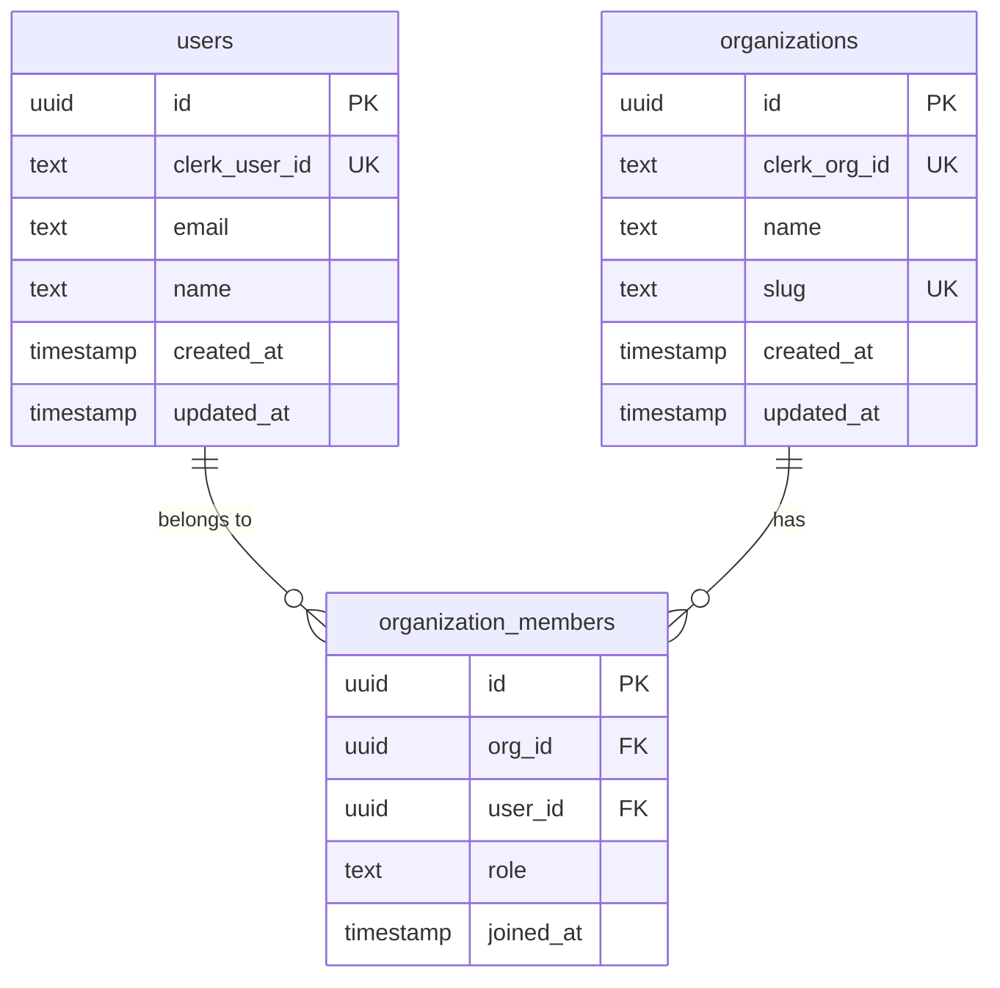

# Database Schema

> Authoritative documentation for the database structure — tables, columns, relationships, and the reasoning behind key design choices.

<!--
Agent: database-engineer
When:
  - Written when the first schema migration is applied.
  - Updated within the same PR as any migration that adds, removes, or renames a table or column.
  - ERD must be regenerated whenever a relationship changes.
  - NEVER let the Migration History fall behind — it is the audit trail for schema changes.
How:
  1. ERD: Use Mermaid erDiagram syntax. Every table in the Tables section must appear in the ERD.
  2. Tables: document every column. "id", "created_at", "updated_at" must still appear — do not omit them as "obvious".
  3. Nullable column means the application can function without this data. If a column is almost never null in practice but is marked nullable, flag it with a note — it may be a schema mistake.
  4. Indexes: every foreign key must have an index unless you have an explicit reason not to. Document the reason if omitting.
  5. Key Relationships: describe referential integrity rules in plain English — what happens on delete/update (CASCADE, RESTRICT, SET NULL). These should match the migration SQL exactly.
  6. Migration History: add a row for every migration file, in order. Never retroactively edit past migrations.
-->

---

## ERD

_[Replace with a complete Mermaid erDiagram. Every table must appear. Include relationship cardinality: ||--o{, }o--||, ||--||, etc. See Mermaid docs for syntax.]_

_[Replace the above with the actual schema. Add all tables.]_

---

## Tables

_[Add one subsection per table. Copy the subsection template below.]_

---

### `users`

_[What this table represents and why it exists. Note any sync relationship with external systems — e.g., "synced from Clerk via webhook".]_

| Column | Type | Nullable | Description |
|--------|------|----------|-------------|
| `id` | `uuid` | No | Primary key — generated by Supabase (`gen_random_uuid()`) |
| `clerk_user_id` | `text` | No | Clerk user ID — used to link Clerk identity to this record. Unique. |
| `email` | `text` | No | User's primary email address. Kept in sync with Clerk via webhook. |
| `name` | `text` | Yes | Display name. Null until user completes onboarding. |
| `created_at` | `timestamptz` | No | Row creation time — set by `DEFAULT now()` |
| `updated_at` | `timestamptz` | No | Last modification time — maintained by `moddatetime` trigger |
| _[column]_ | _[type]_ | _[Yes/No]_ | _[Description]_ |

---

### `_[table_name]_`

_[What this table represents and why it exists.]_

| Column | Type | Nullable | Description |
|--------|------|----------|-------------|
| `id` | `uuid` | No | Primary key |
| `created_at` | `timestamptz` | No | Row creation time |
| `updated_at` | `timestamptz` | No | Last modification time |
| _[column]_ | _[type]_ | _[Yes/No]_ | _[Description]_ |

---

## Indexes

_[List every index beyond the implicit primary key indexes. Include the reason — indexes have storage and write costs, so every index should have a documented justification.]_

| Table | Column(s) | Index Type | Reason |
|-------|-----------|------------|--------|
| `users` | `clerk_user_id` | `UNIQUE` | Webhook handler looks up users by Clerk ID on every event — must be fast and unique |
| `users` | `email` | `UNIQUE` | Email uniqueness constraint; used for login lookups |
| _[table]_ | _[column(s)]_ | _[BTREE / GIN / GiST / UNIQUE]_ | _[Why this query pattern needs this index]_ |
| _[table]_ | _[column(s)]_ | _[Type]_ | _[Reason]_ |

---

## Key Relationships

_[Describe each foreign key relationship in plain English, including the referential integrity action. Match the actual migration SQL — if you're unsure, check the migration file.]_

**`organization_members.user_id` → `users.id`**
Each organization member record belongs to exactly one user. `ON DELETE CASCADE` — if a user is deleted, all their membership records are also deleted. This prevents orphaned membership rows.

**`organization_members.org_id` → `organizations.id`**
Each organization member record belongs to exactly one organization. `ON DELETE CASCADE` — if an organization is deleted, all member records for that org are deleted.

_[Add one paragraph per relationship. Pattern: `[table.column] → [table.column]` followed by the cardinality, the ON DELETE behavior, and the business reason for that behavior.]_

**`_[table.column]_` → `_[table.column]_`**
_[Describe the relationship, cardinality, ON DELETE / ON UPDATE behavior, and why.]_

---

## Migration History

_[Every migration file in chronological order. Add a row when a new migration is applied — never retroactively edit or reorder rows. Migration names should match the actual file names in your migrations directory.]_

| Migration | Date Applied | Description |
|-----------|-------------|-------------|
| `_[e.g., 20240101000000_initial_schema]_` | _[YYYY-MM-DD]_ | _[e.g., Create users, organizations, and organization_members tables with RLS policies]_ |
| `_[e.g., 20240115000000_add_user_name]_` | _[YYYY-MM-DD]_ | _[e.g., Add nullable `name` column to users; backfill from Clerk display_name field]_ |
| `_[migration name]_` | _[YYYY-MM-DD]_ | _[Description of what changed and why]_ |

---

_Last updated: — | Updated by: —_
